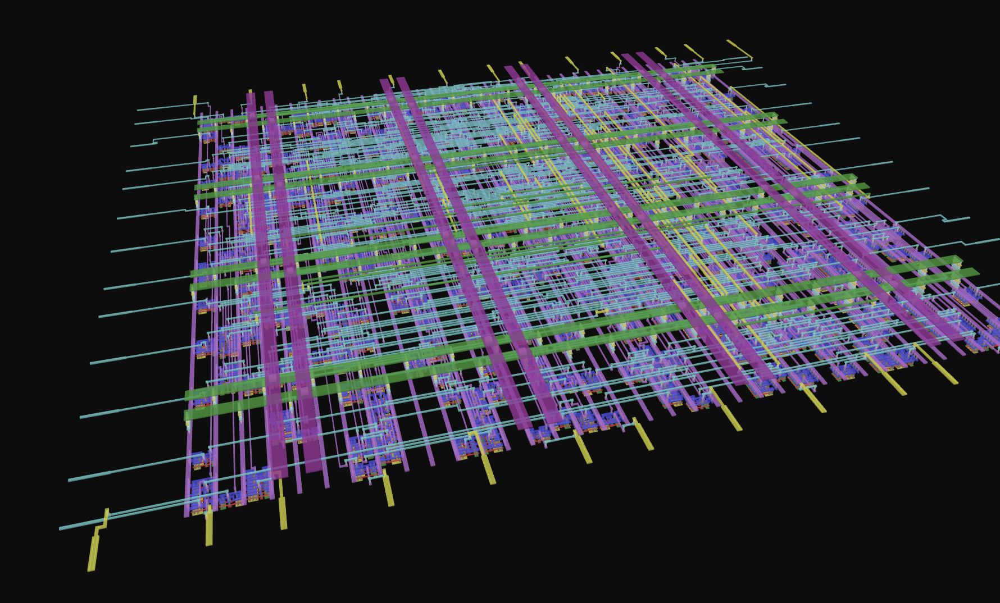
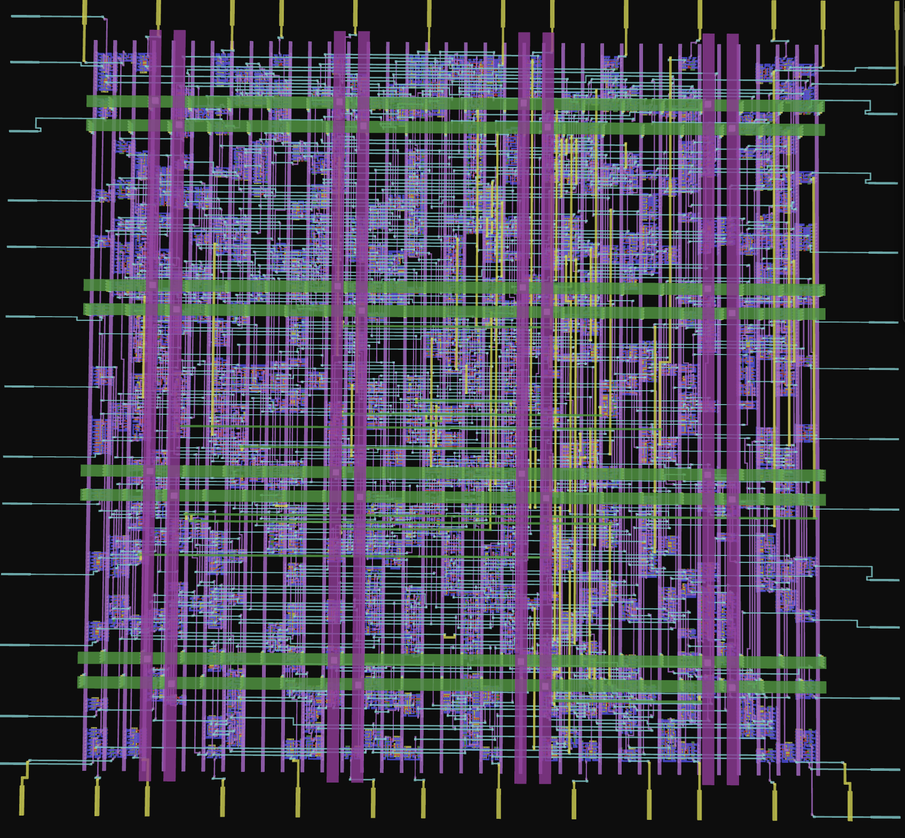
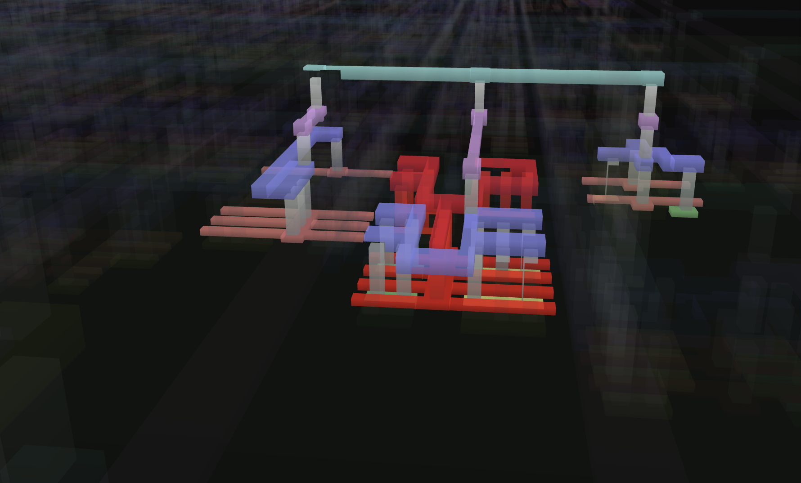

# Flux-16: 16-Bit ALU Physical Design & Signoff

Physical design and tapeout-ready layout implementation of a 16-bit Arithmetic Logic Unit (ALU) targeting the open-source **SkyWater 130nm (SKY130)** process design kit (PDK).

---

## Layout Visualizations

| 3D Render | Die / Top View | Standard Cell / Gate View |
| :---: | :---: | :---: |
|  |  |  |

*Layout visual renders generated using [Tiny Tapeout Explorer](https://znah.net/tiny_explorer/).*

---

## Implementation Overview

Automated the complete RTL-to-GDSII digital implementation flow using the **OpenLane** ASIC design framework, targeting clean signoff under the `sky130_fd_sc_hd` standard cell library.

### Physical Design & Signoff Flow Highlights
1. **Floorplanning & PDN Generation:** Defined core/die boundaries, aspect ratio, standard cell rows, and I/O pin placement. Synthesized an optimal Power Distribution Network (PDN) to mitigate IR drop across the macro.
2. **Clock Tree Synthesis (CTS):** Synthesized a balanced clock distribution network to minimize skew and insertion delay across registers.
3. **Antenna Rule Checking (ARC):** Extracted metal layer antenna ratios and inserted antenna diodes where necessary to prevent gate-oxide breakdown during plasma etching.
4. **Static Timing Analysis (STA):** Performed setup/hold timing verification using OpenSTA to ensure zero negative slack (WNS/TNS $\ge 0$) under defined operating conditions.
5. **Physical Verification (Signoff):**
   - **DRC (Design Rule Checking):** Validated full geometric compliance (spacing, width, enclosure) against SkyWater manufacturing rules using Magic and KLayout.
   - **LVS (Layout Versus Schematic):** Extracted device netlists from layout geometries to verify full topological equivalence against the synthesized gate-level netlist.

---
## Key Physical Design & Signoff Metrics

| Category | Metric | Value | Signoff Target / Status |
| :--- | :--- | :--- | :--- |
| **Process Node** | Technology / PDK | SkyWater 130nm | `sky130_fd_sc_hd` |
| **Geometry** | Die Area | 0.0138 mm² (~13,815 µm²) | Within floorplan limits |
| | Core Utilization | 40% | Target: < 60% |
| | Standard Cell Count | 1,425 | Post-CTS |
| **Performance** | Clock Target | 10 MHz (100 ns period) | Target achieved |
| | Worst Setup Slack (`-max`) | +1.17 ns | Slack ≥ 0.00 ns (Met) |
| | Worst Hold Slack (`-min`) | +4.41 ns | Slack ≥ 0.00 ns (Met) |
| | Worst Negative Slack (WNS) | 0.00 ns | Zero violations |
| | Total Negative Slack (TNS) | 0.00 ns | Zero violations |
| **Power** | Total Power | 261 µW (0.261 mW) | Typical Corner (TT, 1.8V, 25°C) |
| | Power Breakdown | 41.0% Internal, 59.0% Switching, <0.1% Leakage | Combinational logic |
| **Signoff** | Magic / KLayout DRC | 0 violations | **PASSED** |
| | Netgen LVS | Clean (0 mismatches) | **PASSED** |
| | Antenna Violations | 0 | **PASSED** (diodes inserted) |
---

## Limitations & Technical Takeaways

- **Memory Overhead in Physical Verification:** OpenLane relies heavily on Magic VLSI for extraction and DRC. For larger SoC layouts, hierarchical extraction in Magic can lead to significant RAM scaling bottlenecks compared to commercial signoff engines (e.g., Calibre, Pegasus).
- **Multi-Corner Multi-Mode (MCMM) Timing:** The OpenLane 1.x pipeline provides limited native multi-corner timing coverage in a single run. Emerging alternatives like **LibreSilicon/LibreLane** introduce better parallelization across process, voltage, and temperature (PVT) corners.
- **Planar vs. FinFET Physical Constraints:** Working with a planar 130nm node highlights the transition challenges to advanced FinFET nodes, where lithography requires strict track compliance, non-default design rules (NDRs), and complex fill patterns.

---

## Future Work

- **Full CPU Integration:** Integrate Flux-16 into a complete 16-bit Harvard/Von Neumann RISC processor core and generate a hardened macro with integrated SRAM.
- **Timing Closure Optimization:** Explore manual standard-cell placement density adjustments and multi-VT cell swaps to optimize power, performance, and area (PPA).